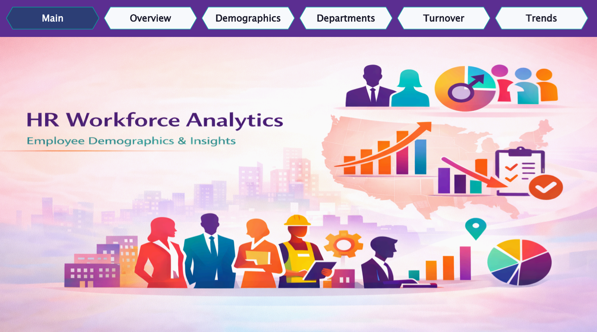
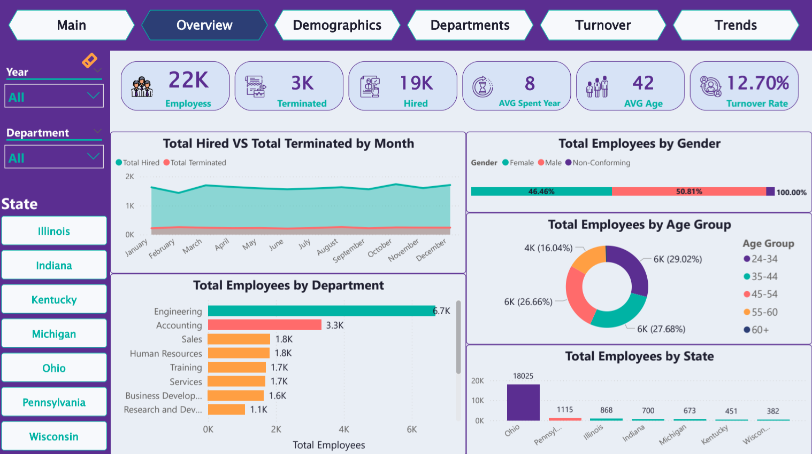
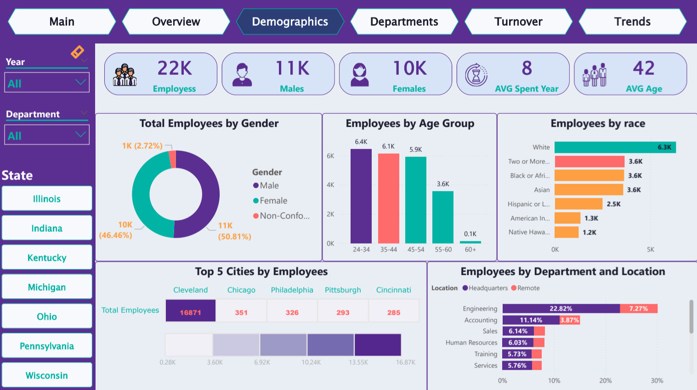
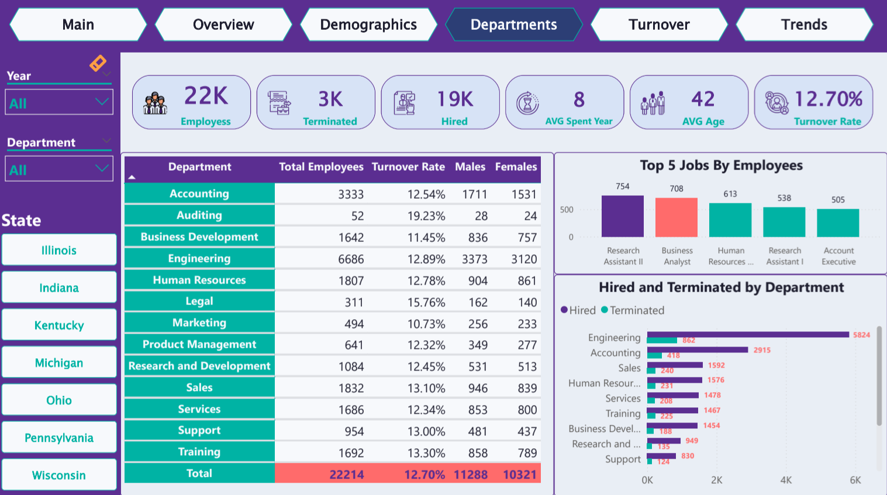
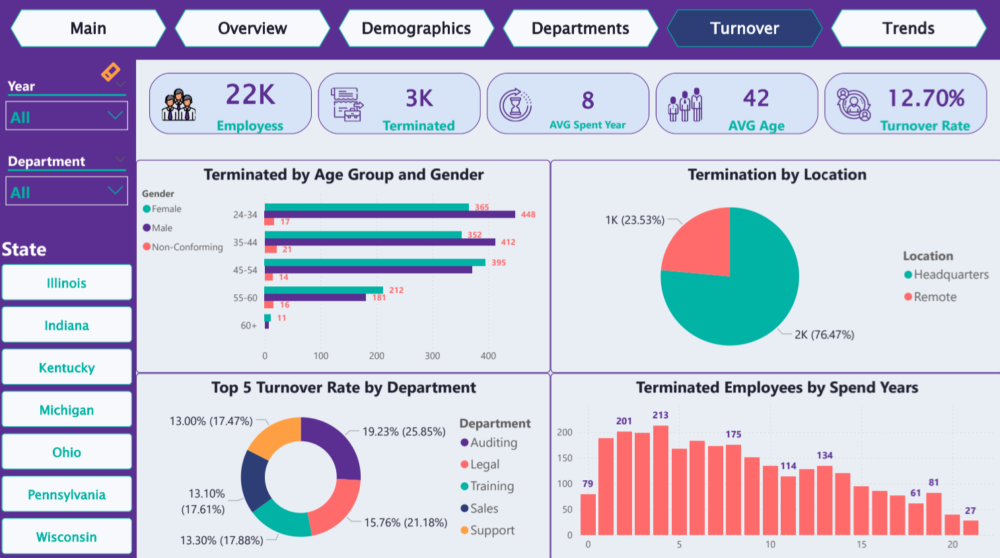
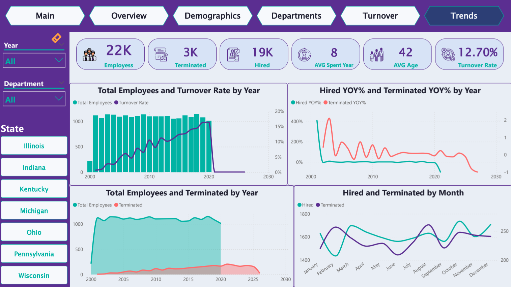

# 👥 HR Workforce Analytics Dashboard

## 📌 Why This Project?
Why do employees really leave a company? Is it the department they work in, their work location, or just the natural lifespan of a job? 

To answer these questions, I worked on this HR Workforce Analytics project. Instead of just creating charts, my main goal was to take raw, messy HR data, clean it up, and build a story that helps management understand their team better and make smart retention decisions.

## 🎯 Key HR Metrics Highlighted
* **Total Employees:** 22K 
* **Terminated Employees:** 3K 
* **Overall Turnover Rate:** 12.70% 
* **Average Age:** 42 Years 
* **Average Tenure:** 8 Years

## 🖼️ Dashboard Previews

### 1. Main Welcome Screen

### 2. High-Level Overview
Shows the main KPIs like the 12.70% turnover rate [cite: 460] and hiring trends.

### 3. Employee Demographics
A closer look at gender, age groups, and race distribution.

### 4. Department Analysis
Breaking down headcount and turnover rate by each department.

### 5. Turnover Deep Dive
Understanding exactly who is leaving and from which location.

### 6. Historical Trends
Tracking the YoY hiring and termination percentages.

## 🛠️ Data Preparation (Behind the Scenes)
Before building any visuals in Power BI, I spent a lot of time in **Power Query** making sure the data was clean and ready. Here is what I did:
* **Clean Names:** Merged the first and last name columns to create a clean `Full Name` column.
* **Calculating Age:** Extracted the exact age from the employees' birthdates, then grouped them into `Age Group` buckets (like 24-34, 35-44) to make demographic analysis easier.
* **Finding the "Working Status":** The termination date column had missing values and future dates. I created conditional rules to accurately flag who is "Still Working" and who is "Terminated".
* **Years of Service:** Calculated `Spend Years` to track exactly how long each employee stayed with the company before leaving.

## 💡 What Did The Data Tell Us?

After modeling the data and writing the necessary DAX measures, I found some really interesting insights:

### 1. Turnover & Retention
* **The "Danger Zone":** The highest number of resignations happens in the first 5 years of employment , especially peaking around years 2 and 3. This means the company needs to check its onboarding process.
* **Location Matters:** Even though the company supports remote work, a massive **76.47%** of the people who left the company were working from the Headquarters. Remote workers tend to stay longer!
* **Department Surprises:** The Auditing department is very small (only 52 people) , but it has the highest turnover rate in the entire company at **19.23%**. 

### 2. Demographics & Diversity
* **Gender Balance:** The workplace is very balanced. Males make up **50.81%** , and Females make up **46.46%**.
* **Company Size & Age:** The company has a total of 22K employees  with an average age of 42. They clearly prefer hiring younger talent, as the 24-34 age group is the largest.
* **Locations:** Ohio is the main hub, housing over 18,000 employees, leaving other states far behind.

---

---

## 📂 Repository Contents
To keep things organized, here is what you will find in this repository:
* `HR.pbix`: The main Power BI file containing the data model and the dashboard.
* `Human Resources.csv`: The raw dataset I started with.
* `HR_Analysis_Project_EN.pdf`: The project requirements and business questions.
* `HR.pdf`: A static PDF export of the dashboard pages.
* `Theme.json`: The custom color theme I created for the dashboard.
* `Media/`: A folder containing all the screenshots and visual assets.
* `README.md`: This file!

